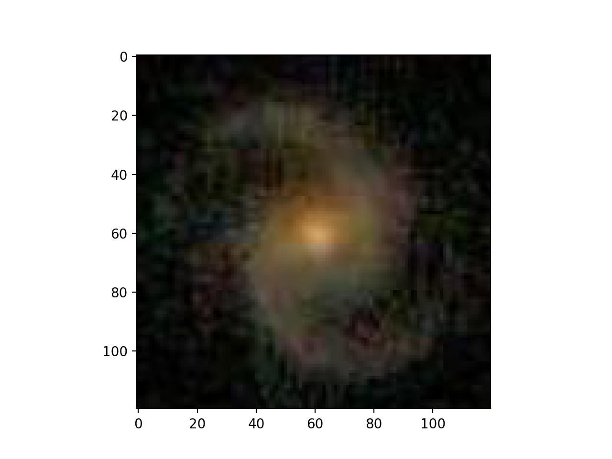
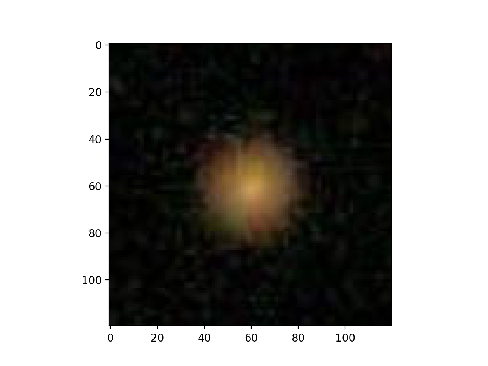
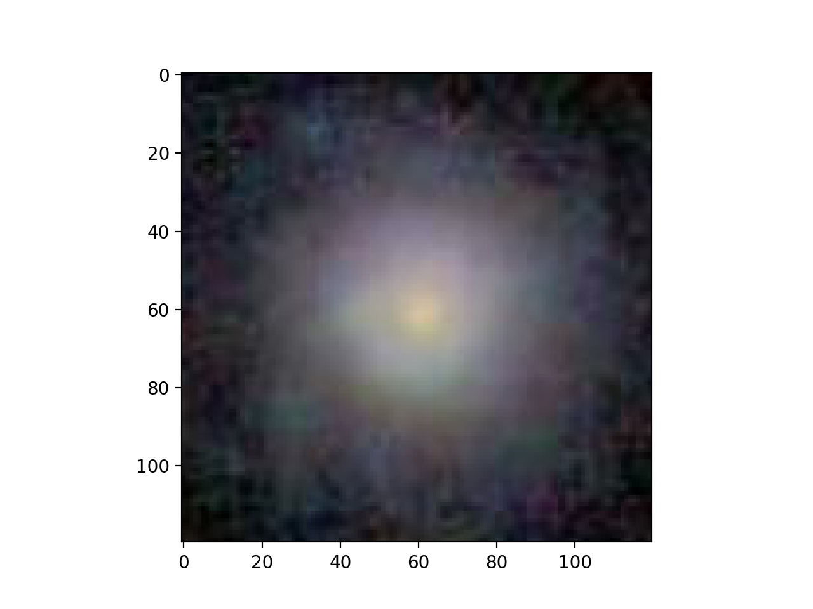

# galaxy-classification
Using machine learning to classify galaxy images from GalaxyZoo

This is a project I did for my "Machine Learning for Physicists" module at uni. It uses a convolutional neural network and data from the crowdsourced GalaxyZoo project to classify photographs of galaxies into one of three categories - Spiral, Elliptical, or Unsure. For example:

| | | |
|:---:|:---:|:---:|
|Spiral|Elliptical|Unsure|

Without having done too much optimisation, it can currently handily achieve 70+% accuracy when tested. And having inspected a sample of the "incorrect" guesses myself, I think that a significant part of that error comes from poorly labelled galaxies in the dataset, rather than it being purely program error.

The actual neural network part of this project is relatively uninteresting, being a fairly straightforward application of a classification algorithm, but the real devil is in the dataset.

The Data
---------
The raw data comes from the GalaxyZoo project, an ongoing citizen-science project. The script "get_images.py" will download all the required images for you, although it is a little slow.

One problem with the data as it is is that there are many more spiral/unkown galaxies than there are elliptical ones. Rather than cropping the dataset, which would reduce the efficacy of the network, the symmetry of the problem can be taken advantage of to "upsample" under-represented classifications in the dataset. In this case, each image can be rotated by 90 degrees up to 4 times to produce effectively an entirely "new" piece of training data. This upsampling was used in combination with downsampling/culling to produce a training and testing dataset with approximately equal distributions of all three categories.

The data needs to be normalised to approx. the 0-1 range and centralised before being fed into the system, so the mean pixel value is read from the entire dataset, as is the standard deviation, which is later used to transform the read images freely between their original PIL datatype and a normalised tensor suitable for putting through a neural network.

Misc
-----

If you want to run the program, you'll need a hefty few dependencies, but you can just hit "run" and it should all work fine.

